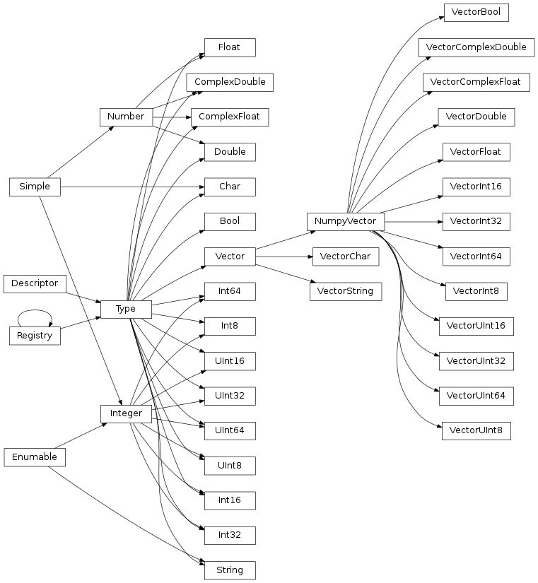

Start simple: Hello World Device!
=================================

Below is the source code of a Hello World! device::

    from asyncio import coroutine
    from karabo.middlelayer import Device, Slot, String

    class HelloWorld(Device):

        __version__ = "2.0"

        greeting = String(
            defaultValue="Hello World!",
            description="Message printed to console.")

        @Slot()
        def hello(self):
            print(self.greeting)

        @coroutine
        def onInitialization(self):
            """ This method will be called when the device starts.

                Define your actions to be executed after instantiation.
            """

The middlelayer device is created by inheriting from the middlelayer's ``Device`` base class.
Below the device class definition are the expected parameters, containing the static schema of the device.
A property `__version__` can indicate the lowest Karabo version in which this device is supposed to run.
In this device we create a Karabo property `greeting` which is also referred to as ``KaraboValue``.
This property has an assigned ``descriptor`` `String` containing the ``attributes``.
In this example the `defaultValue` and the `description` attributes are defined,
which is rendered in the karabo GUI as a text box showing "Hello World!".

Additionally, we create a single ``Slot`` `hello` by using a decorator.
This slot will be rendered in the karabo GUI as a button enabling us to print
the greeting string to console.

Properties: Karabo Descriptors
++++++++++++++++++++++++++++++

As shown by the example, every device has a *schema*, which contains all the details
about the expected parameters, its types, comments, units, everything. In the
middlelayer this schema is built by so-called **karabo descriptors**.
A schema is only broadcasted rarely over the network, typically only during
the initial handshake with the device. Once the schema is known, only
*configurations*, or even only parts of configurations, are sent over
the network in a tree structure called *Hash* (which is not a hash
table).

These configurations know nothing anymore about the meaning of the
values they contain, yet they are very strictly typed: even different
bit sizes of integers are conserved.

**Descriptors** describe the content of a device property. As shown in the *Hello
World* example, The description is done in their attributes, which come from
a fixed defined set.

It may be useful to note that instances of this class do not contain any data,
instead they are describing which values a device property may take and they
are given as keyword arguments upon initialization.

Attributes
++++++++++

Attributes of properties may be accessed during runtime as members of the property descriptor.

+----------------------+------------------------------------+
|**Attribute**         |  **Example**                       |
+----------------------+------------------------------------+
| displayType          | e.g. oct, bin, dec, hex, directory |
+----------------------+------------------------------------+
| minInc               | the inclusive-minimum value        |
+----------------------+------------------------------------+
| minExc               | the exclusive-minimum value        |
+----------------------+------------------------------------+
| maxInc               | the inclusive-maximum value        |
+----------------------+------------------------------------+
| maxExc               | the exclusive-maximum value        |
+----------------------+------------------------------------+
| minSize              | the minimum size of vector         |
+----------------------+------------------------------------+
| maxSize              | the maximum size of vector         |
+----------------------+------------------------------------+
| daqPolicy            | e.g. DaqPolicy.SAVE                |
+----------------------+------------------------------------+
| warnLow              | warn threshold low                 |
+----------------------+------------------------------------+
| warnHigh             | warn threshold high                |
+----------------------+------------------------------------+
| alarmLow             | alarm threshold low                |
+----------------------+------------------------------------+
| alarmHigh            | alarm threshold high               |
+----------------------+------------------------------------+
| unitSymbol           | e.g. Unit.METER                    |
+----------------------+------------------------------------+
| metricPrefixSymbol   | e.g. MetricPrefix.MILLI            |
+----------------------+------------------------------------+
| accessMode           | e.g. AccessMode.READONLY           |
+----------------------+------------------------------------+
| assignment           | e.g. Assignment.OPTIONAL           |
+----------------------+------------------------------------+
| defaultValue         | the default value or None          |
+----------------------+------------------------------------+
| requiredAccessLevel  | e.g. AccessLevel.EXPERT            |
+----------------------+------------------------------------+
| allowedStates        | the list of allowed states         |
+----------------------+------------------------------------+

Handling timestamps
+++++++++++++++++++

When a user operates on a :class:`~karabo.middlelayer.KaraboValue`, the
timestamp of the result is the newest timestamp of all timestamps that
take part in the operation, unless the user explicitly sets a
different one. This is in line with the validity intervals described
above: if a value is composed from other values, it is valid typically
starting from the moment that the last value has become valid (this
assumes that all values are still valid at composition time, but this
is the responsibility of the user, and is typically already the case).

All properties in Karabo may have timestamps attached. In the middlelayer API
they can be accessed from the ``timestamp`` attribute::

    self.speed.timestamp

They are automatically attached and set to the current time upon
assignment of a value that does not have a timestamp::

    self.steps = 5  # current time as timestamp attached

A different timestamp may be attached using the ``timestamp``
function::

    self.steps.timestamp = Timestamp("2009-09-01 12:34 UTC")

If a value already has a timestamp, it is conserved, even through
calculations. If several timestamps are used in a calculation, the
newest timestamp is used. In the following code, ``self.speed`` gets
the newer timestamp of ``self.distance`` or ``self.times``::

    self.speed = 5 * self.distance / self.times[3]

.. warning::

    Developers should be aware that automated timestamp handling defaults to the
    newest timestamp, i.e. the time at which the last assignment operation
    on a variable in a calculation occured. Additionally, these timestamps are
    not synchronized with XFEL's timing system, but with the host's local clock.
