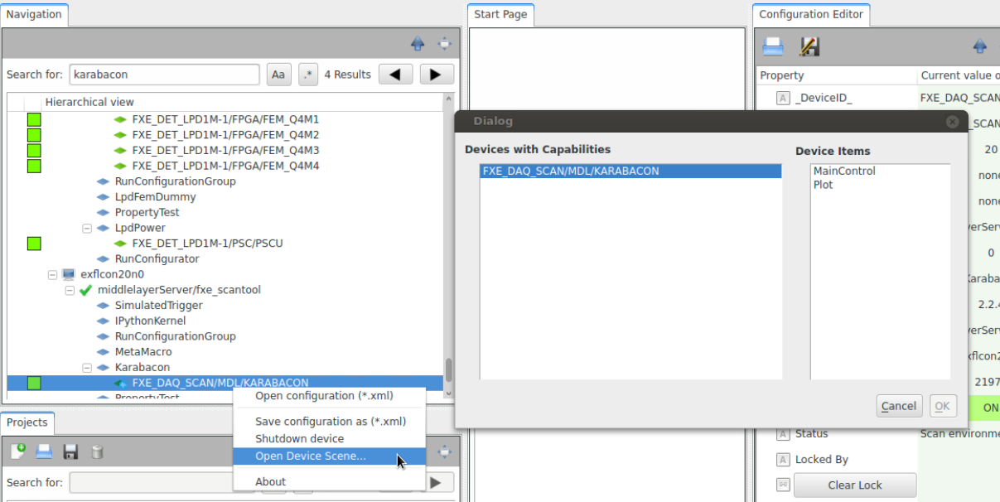

Device Scenes
=============

Karabo provides a protocol for devices to share predefined scenes.
These allows the author of a device to provide what they think are
a good starting point. Moreover, these are easily accessible by
from the topology panel in the GUI:

A default scene can also be accessed by double-clicking on a device.

This section shows how to enable your device to have builtin scenes.

Implementing this functionality requires the creation of a scene, in the
scene editor, conversion to Python, and adding the `requestScene` framework slot.

From scene to Python
--------------------
Begin by drawing an adequate scene in the GUI's scene editor, and save
it locally on your computer as SVG (right-click on scene -> *Save to File*).

Use the *karabo-scene2py* utility to convert the SVG file to Python code:

.. code-block:: Bash

   $ karabo-scene2py scene.svg SA1_XTD2_UND/MDL/GAINCURVE_SCAN > scenes.py

The first argument is the scene file, the second is an optional deviceId to be
substituted.

As it is generated code, make sure the file is PEP8 compliant. The final
result should look more or less like the following:

.. code-block:: Python

   from karabo.common.scenemodel.api import (
       IntLineEditModel, LabelModel, SceneModel, write_scene
    )

   def get_scene(deviceId):
       input = IntLineEditModel(height=31.0,
                                keys=['{}.config.movingAverageCount'.format(deviceId)],
                                parent_component='EditableApplyLaterComponent',
                                width=67.0, x=227.0, y=18.0)
       label = LabelModel(font='Ubuntu,11,-1,5,50,0,0,0,0,0', foreground='#000000',
                          height=27.0, parent_component='DisplayComponent',
                          text='Running Average Shot Count',
                          width=206.0, x=16.0, y=15.0)
       scene = SceneModel(height=1017.0, width=1867.0, children=[input, label])

       return write_scene(scene)

Add this file to your project.

Providing the scene from your device
------------------------------------
In your device, add a read-only `VectorString` property called `availableScenes`,
and  implement the `requestScene` framework slot.
This is a predefined slot, which allows various actors to understand the scene
protocol.

The slot takes a Hash `params` and returns a Hash with the origin, its datatype (deviceScene),
and the scene itself:

.. code-block:: Python

   from karabo.middlelayer import AccessMode, DaqPolicy, VectoString, slot
   from .scenes import get_scene

   availableScenes = VectorString(
       displayedNamed="Available Scenes",
       displayType="Scenes",
       accessMode=AccessMode.READONLY,
       defaultValue=["overview"],
       daqPolicy=DaqPolicy.OMIT)

   @slot
   def requestScene(self, params):
       name = params.get('name', default='overview')
       payload = Hash('success', True, 'name', name,
                      'data', get_scene(self.deviceId))

       return Hash('type', 'deviceScene',
                   'origin', self.deviceId,
                   'payload', payload)

.. note::
   Note that we use here `slot`, and not `Slot()`. These are two
   different functions. `slot` provides framework-level slots,
   whereas `Slot` are device-level.

Providing several scenes from your device
-----------------------------------------
Would you want to provide several scenes (e.g., simple overview and control scene),
you can define several functions in `scenes.py`, and modify `requestScene` to check
`params['name']`:

.. code-block:: Python

   from karabo.middlelayer import AccessMode, DaqPolicy, VectoString, slot
   import .scenes

   availableScenes = VectorString(
       displayedNamed="Available Scenes",
       displayType="Scenes",
       accessMode=AccessMode.READONLY,
       defaultValue=["overview", "controls"],
       daqPolicy=DaqPolicy.OMIT)

   @slot
   def requestScene(self, params):
       payload = Hash('success', False)
       name = params.get('name', default='overview')

       if name == 'overview':
           payload.set('success', True)
           payload.set('name', name)
           payload.set('data', scenes.overview(self.deviceId))

       elif name == 'controls':
           payload.set('success', True)
           payload.set('name', name)
           payload.set('data', scenes.controls(self.deviceId))

       return Hash('type', 'deviceScene',
                   'origin', self.deviceId,
                   'payload', payload)

.. note::
    There is the convention that the default scene (of your choice)
    should be first in the `availableScenes` list.

Providing Table Elements
------------------------
As described in :ref:`table-element`, table elements are vectors of hash,
the schema is specified as Hash serialized to XML, (which *karabo-scene2py*
takes care of).

In this case, it's fine to break the PEP8 80 characters limit. A table element
looks like:

.. code-block:: Python

     table = TableElementModel(
         column_schema='TriggerRow:<root KRB_Artificial="">CONTENT</root>',
         height=196.0, keys=['{}.triggerEnv'.format(deviceId)],
         klass='DisplayTableElement',
         parent_component='DisplayComponent',
         width=436.0, x=19.0, y=484.0
    )

Linking To Other Devices Scenes
-------------------------------
The following applies whether you want to link to another of your scenes or to
another device's scene.

Let's say that you want to add links in your `overview` scene to your
`controls` scene.

The :class:`DeviceSceneLinkModel` allows you to specify links to other
dynamically provided scenes.

In your `scenes.py`, import `DeviceSceneLinkModel` and `SceneTargetWindow` from
`karabo.common.scenemodel.api` and extend :func:`overview(deviceId)`:

.. code-block:: Python

   from karabo.common.scenemodel.api import DeviceSceneLinkModel, SceneTargetWindow

    def overview(deviceId):
       # remaining scene stays the same

        link_to_controls = DeviceSceneLinkModel(
            height=40.0, width=314.0, x=114.0, y=227.0,
            parent_component='DisplayComponent',
            keys=['{}.availableScenes'.format(deviceId)], target='controls',
            text='Controls scene',
            target_window=SceneTargetWindow.Dialog)

        children = [label, input, link_to_controls]
        scene = SceneModel(height=1017.0, width=1867.0, children=children)

       return write_scene(scene)

If you want to link to another device, make :func:`overview` accept another
`remoteDeviceId` parameter, and point the link to that device:

.. code-block:: Python

   def overview(deviceId, remoteDeviceId):
       # remaining scene stays the same

       link_to_remote = DeviceSceneLinkModel(
           height=40.0, width=314.0, x=114.0, y=267.0,
           parent_component='DisplayComponent',
           text='Link to other device',
           keys=['{}.availableScenes'.format(remoteDeviceId)], target='scene',
           target_window=SceneTargetWindow.Dialog
        )

        children = [label, input, link_to_controls, link_to_remote]
        scene = SceneModel(height=1017.0, width=1867.0, children=children)

       return write_scene(scene)

.. note::

    `remoteDeviceId` is merely the deviceId, here. If you have a proxy,
    you may want to rethink the arguments to `overview` and pass it `self` or
    the proxy object. Then you can find out exactly what scenes are available
    there, e.g.:

    target = 'controls' if 'controls' in px.availableScenes else 'scene'
    keys=['{}.availableScenes'.format(px.deviceId)], target=target,

Reference Implementations
-------------------------
GainCurveScan_: provides a single default scene

Karabacon_: provides several scenes

KEP21_: definition of the scene protocol

.. _GainCurveScan: https://git.xfel.eu/gitlab/karaboDevices/gainCurveScan
.. _Karabacon: https://git.xfel.eu/gitlab/karaboDevices/Karabacon
.. _KEP21: https://git.xfel.eu/gitlab/Karabo/enhancement-proposals/blob/kep21/keps/kep-0021.rst
