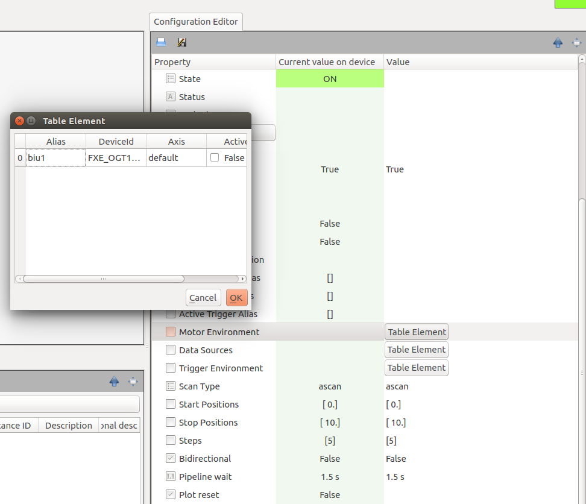

.. _table-element:

Table Element (VectorHash)
==========================

Known as :class:`TABLE_ELEMENT` in the bound API, :class:`VectorHash` allows
users to specify custom entries, in the form of a table, that are,
programmatically, available later in the form of an iterable.

Like other karabo properties, :class:`VectorHash` is initialized by
displayedName, description, defaultValue, and accessMode. As well, it has a
`rows` field that describes what each row in the table contains.

This `rows` field expects a class that inherits from :class:`Configurable`.

.. code-block:: Python

    class RowSchema(Configurable):
        deviceId = String(
                displayedName="DeviceId",
                defaultValue="")
        instanceCount = Int(
                displayedName="Count")

This class can have as many parameters as desired, and these will be represented
as columns in the table.

With :class:`RowSchema`, the definition of the VectorHash is as follows:

.. code-block:: Python

    class MyMLDevice(Device):
        userConfig = VectorHash(
                       rows=RowSchema,
                       displayedName="Hot Initialisation",
                       defaultValue=[],
                       minSize=1, maxSize=4)

The user will now be presented with an editable table:

Note that it is possible to provide the user with predefined entries, such as
default values or reading a configuration file, by providing a populated array
in the ``defaultValue`` option.
The ``minSize`` and ``maxSize`` arguments can limit the table's size if
needed.

.. code-block:: Python

    class MyMLDevice(Device):
        userConfig = VectorHash(
                       rows=RowSchema,
                       displayedName="Default Value Example",
                       defaultValue=[Hash("deviceId", "XHQ_EG_DG/MOTOR/1",
                                          "instanceCount", 1),
                                     Hash("deviceId", "XHQ_EG_DG/MOTOR/2",
                                          "instanceCount", 2)],
                       minSize=1, maxSize=4)

Customization
-------------

The Table Element can be a bit customized with the **displayType** attribute. Specifying
for example

.. code-block:: Python

    class RowSchema(Configurable):
        deviceId = String(
                displayedName="DeviceId",
                defaultValue="")
        state = String(
                defaultValue="UNKNOWN",
                displayType="State",
                displayedName="State")

will have a table schema that describes the state column with a displayType ``State``. The graphical user
interface can then color the column according to state color.

With **Karabo 2.14.X**, the table offers more customization, e.g.

.. code-block:: Python

    class RowSchema(Configurable):
        progress = Double(
                displayedName="ProgressBar",
                displayType="TableProgressBar"
                defaultValue=0.0,
                minInc=0.0,
                maxInc=100.0)

        stringColor = String(
                defaultValue="anystring",
                displayType="TableColor|default=white&xfel=orange&desy=blue",
                displayedName="stringColor")

        numberColor = Int32(
                displayedName="Number Color",
                displayType="TableColor|0=red&1=orange&2=blue"
                defaultValue=0)

Hence, for different displayTypes more options are available.

- A progressbar can be declared with ``TableProgressBar`` on a number descriptor.
- Background coloring can be provided for strings and numbers with the ``TableColor``
  displayType. The coloring is then appended in an URI scheme (separator `&`) which is
  append to the displayType after `|`.
  Declaration of a default background brush can be set with the *default* setting.

.. code-block:: Python

    class RowSchema(Configurable):
        progress = Bool(
                displayedName="Bool Button",
                displayType="TableBoolButton",
                defaultValue=True)

For **read only** table element a button can be declared via ``TableBoolButton``.
The button is enabled depending on the boolean setting.

Clicking the button will send a Hash to the device via the slot **requestAction**.

The hash contains keys with data::

    action: TableButton
    path: the property key
    table: the table data

The table data itself is a Hash with::

    data = Hash(
        "rowData", h,
        "row", row,
        "column", column,
        "header", header)

The rowData is a Hash of the row of the table button. The elements `row` and `column`
provide the indexes of the button and the header the column string.

Another option (**since Karabo 2.15.X**) for a button can be the ``TableStringButton``. Besides access level considerations
this button is always enabled to provide an action on a **deviceScene** or **url**.

.. code-block:: Python

    class RowSchema(Configurable):

        description = String(
                displayedName="Description",
                defaultValue="")

        view = String(
                displayedName="View",
                displayType="TableStringButton",
                defaultValue="")

The value for both protocols are strings and an example to set a table

.. code-block:: Python

    device_scene = "deviceScene|deviceId=YOURDEVICE&name=YOURSCENENAME"
    open_url = "url|www.xfel.eu"

    self.table = [Hash("description", "Important device", "view", device_scene),
                  Hash("description", "Important device doc", "view", open_url)]

Using Entries
-------------

Once the VectorHash has been populated, it is possible to iterate through its
rows, which are themselves internally stored as a ``TableValue``, which itself
encapsulates a `numpy` array.
From **Karabo 2.14.0** onwards it is possible to convert the `np.array` value
to a list of Hashes with

.. code-block:: Python

    table = self.userConfig.to_hashlist()

Moreover, iterating over the encapsulated numpy array can be done like

.. code-block:: Python

    @Slot(displayedName="Do something with table")
    async def doSomethingTable(self):
        # This loops over the array (.value)
        for row in self.userConfig.value:
            # do something ..., e.g. check the first column
            first_column = row[0]

Action on Update
----------------

If an action is required on VectorHash update, e.g. a row is added or removed,
then the VectorHash should be defined within a decorator:

.. code-block:: Python

    @VectorHash(rows=RowSchema,
                displayedName="Hot Initialisation",
                defaultValue=[])
    async def tableUpdate(self, updatedTable):
        self.userConfig = updatedTable
        # This loops over the array (.value)
        for row in updatedTable.value:
            # do something ...
