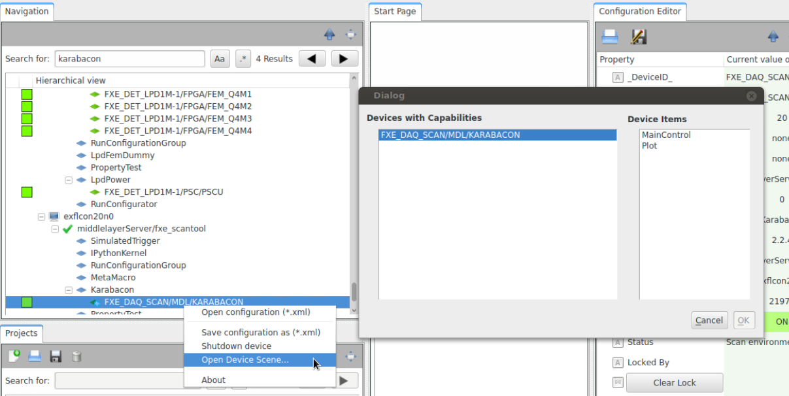

Default Device Scenes
=====================
Karabo provides a protocol for devices to share predefined scenes.
These allows the author of a device to provide what they think are
a good starting point. Moreover, these are easily accessible by
from the topology panel in the GUI:

This section shows how to enable your device to have builtin scenes.

Implementing this functionality requires the creation of a scene, in the
scene editor, conversion to Python, and adding the `requestScene` framework slot.

From scene to Python
--------------------
Begin by drawing an adequate scene in the GUI's scene editor, and save
it locally on your computer as SVG (right-click on scene -> *Save to File*).

Use the *karabo-scene2py* utility to convert the SVG file to Python code:

.. code-block:: Bash

   $ karabo-scene2py scene.svg > scenes.py

As it is generated code, a few modifications are required. Begin by making 
the file PEP8 compliant, 

Then wrap all scene-related code into a single function, which should take a 
`deviceId` string argument, and returns `write_scene(scene)`, instead of printing it.

Finally, replace all the hard-coded instance ids in strings with::
    
    '{}.property'.format(deviceId)

Your final `scenes.py` should look more or less as follows:

.. code-block:: Python

   from karabo.common.scenemodel.api import (
       IntLineEditModel, LabelModel, SceneModel, write_scene
    )

   def get_scene(deviceId):
       scene0 = IntLineEditModel(height=31.0, 
                                 keys=['{}.config.movingAverageCount'.format(deviceId)], 
                                 parent_component='EditableApplyLaterComponent', 
                                 width=67.0, x=227.0, y=18.0)
       scene1 = LabelModel(font='Ubuntu,11,-1,5,50,0,0,0,0,0', foreground='#000000',
                           height=27.0, parent_component='DisplayComponent',
                           text='Running Average Shot Count',
                           width=206.0, x=16.0, y=15.0)
       scene = SceneModel(height=1017.0, width=1867.0, children=[scene0, scene1])

       return write_scene(scene)

Add this file to your project.

Providing the scene from your device
------------------------------------
In your device, add a read-only `VectorString` property called `availableScenes`,
and  implement the `requestScene` framework slot.
This is a predefined slot, which allows various actors to understand the scene
protocol.

The slot takes a Hash `params` and returns a Hash with the origin, its datatype (deviceScene),
and the scene itself:

.. code-block:: Python

   from karabo.middlelayer import accessMode, DaqPolicy, VectoString, slot
   from .scenes import get_scene

   availableScenes = VectorString(
       displayedNamed="Available Scenes",
       displayType="Scenes",
       accessMode=accessMode.READONLY,
       defaultValue=["overview"],
       daqPolicy=DaqPolicy.OMIT)

   @slot
   def requestScene(self, params):
       name = params.get('name', default='overview')
       payload = Hash('success', True, 'name', name,
                      'data', get_scene(self.deviceId))

       return Hash('type', 'deviceScene', 
                   'origin', self.deviceId,
                   'payload', payload)

.. note:
   Note that we use here `slot`, and not `Slot()`. These are two
   different functions. `slot` provides framework-level slots,
   whereas `Slot` are device-level.

Providing several scenes from your device
-----------------------------------------
Would you want to provide several scenes (e.g., simple overview and control scene),
you can define several functions in `scenes.py`, and modify `requestScene` to check
`params['name']`:

.. code-block:: Python

   from karabo.middlelayer import accessMode, DaqPolicy, VectoString, slot
   import .scenes

   availableScenes = VectorString(
       displayedNamed="Available Scenes",
       displayType="Scenes",
       accessMode=accessMode.READONLY,
       defaultValue=["overview", "controls"],
       daqPolicy=DaqPolicy.OMIT)

   @slot
   def requestScene(self, params):
       payload = Hash('success', False)
       name = params.get('name', default='overview')

       if name == 'overview':
           payload.set('success', True)
           payload.set('name', name)
           payload.set('data', scenes.overview(self.deviceId))

       elif name == 'controls':
           payload.set('success', True)
           payload.set('name', name)
           payload.set('data', scenes.controls(self.deviceId))

       return Hash('type', 'deviceScene', 
                   'origin', self.deviceId,
                   'payload', payload)

.. note::
    There is the convention that the default scene (of your choice)
    should be first in the `availableScenes` list.

Providing Table Elements
------------------------
As described in :ref:`table-element`, table elements are vectors of hash,
the schema is specified as Hash serialized to XML, (which *karabo-scene2py* 
takes care of).

In this case, it's fine to break the PEP8 80 characters limit. A table element
looks like:

.. code-block:: Python

     scene0 = TableElementModel(
         column_schema='TriggerRow:<root KRB_Artificial="">CONTENT</root>',
         height=196.0, keys=['{}.triggerEnv'.format(deviceId)],
         klass='DisplayTableElement',
         parent_component='DisplayComponent', 
         width=436.0, x=19.0, y=484.0)

Reference Implementations
-------------------------
GainCurveScan_: provides a single default scene
Karabacon_: provides several scenes
KEP21_: definition of the scene protocol

.. _GainCurveScan: https://git.xfel.eu/gitlab/karaboDevices/gainCurveScan
.. _Karabacon: https://git.xfel.eu/gitlab/karaboDevices/Karabacon
.. _KEP21: https://git.xfel.eu/gitlab/Karabo/enhancement-proposals/blob/kep21/keps/kep-0021.rst
