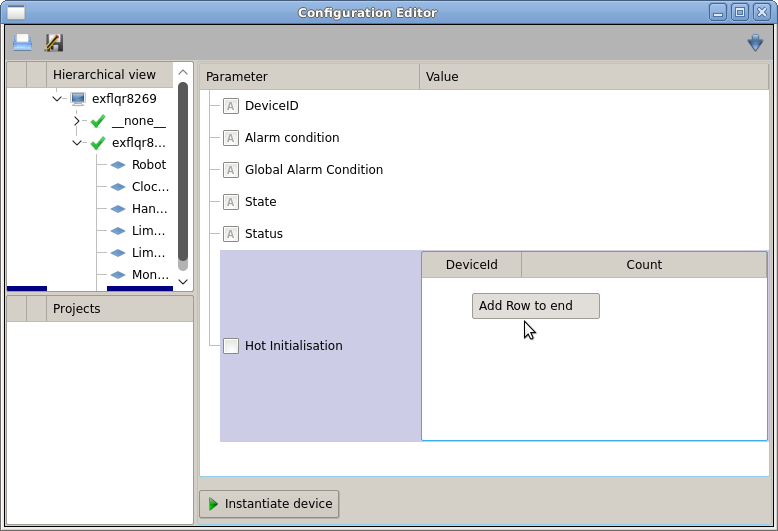

.. _table-element

Table Element (VectorHash)
==========================

Known as :class:`TABLE_ELEMENT` in the bound API, :class:`VectorHash` allows
users to specify custom entries, in the form of a table, that are,
programmatically, available later in the form of an iterable.

Like other karabo properties, :class:`VectorHash` is initialized by
displayedName, description, defaultValue, and accessMode. As well, it has a
`rows` field that describes what each row in the table contains.

This `rows` field expects a class that inherits from :class:`Configurable`.

.. code-block:: Python

    class RowSchema(Configurable):
        deviceId = String(
                displayedName="DeviceId",
                defaultValue="")
        instanceCount = Int(
                displayedName="Count")

This class can have as many parameters as desired, and these will be represented
as columns in the table.

With :class:`RowSchema`, the definition of the VectorHash is as follows:

.. code-block:: Python

    class MyMLDevice(Device):
        self.userConfig = VectorHash(
                            rows=RowSchema,
                            displayedName="Hot Initialisation",
                            defaultValue=[])
The user will now be presented with an editable table:

Note that it is possible to provide the user with predefined entries, such as
default values or reading a configuration file, by providing a populated array
in the ``defaultValue`` option.

Using Entries
-------------
Once the VectorHash has been populated, it is possible to iterate through its
rows, which are themselves internally stored as tuples and so iterable.
As with any Karabo datatypes, data are stored in VectorHash.value:

.. code-block:: Python

    @Slot(displayedName="Save to file")
    @coroutine
    def saveToFile(self):
        self.status = "Saving..."

        with open("outputfile.txt", "a") as outfile:
            outfile.write(len(self.userConfig.value))
            for row in self.userConfig.value:
                outfile.write("{},{}\n".format(row[0], row[1]))

        self.status = "Saved"

Action on Update
----------------
If an action is required on VectorHash update, when the user adds, removes, or
edits a row, then the VectorHash should be defined within a decorator:

.. code-block:: Python

    @VectorHash(rows=RowSchema,
                displayedName="Hot Initialisation",
                defaultValue=[])
    @coroutine
    def tableUpdate(self, updatedTable):
        self.userConfig = updatedTable
        for row in updatedTable.value:
            print(row)

To keep :func:`saveToFile` working without modification, `updatedTable`,
which the function receives upon the user committing the changes, is assigned to
`self.userConfig`.
